# Kassenbuch der Kleingartenanlage

## Bedienungs- und Betriebsanleitung

Diese Anleitung beschreibt das Excel-Programm **Programm Kassenbuch 2018** vollständig: welche Blätter es gibt, was auf jedem Blatt einzutragen ist, wie die automatische Kategoriefindung arbeitet und wie das Jahr abgeschlossen wird.

Die Anleitung ist Teil des Projekts und wird bei Programmänderungen mitgeführt. Die Word-Fassung entsteht aus der Textfassung `doku/Bedienungsanleitung.md`; die Bilder erzeugt `tools/make_screenshots.ps1`.

---

# 1 Über dieses Handbuch

## 1.1 An wen es sich richtet

Das Handbuch richtet sich an die Person, die das Kassenbuch führt, also in aller Regel an die Kassiererin oder den Kassierer des Vereins. Es setzt keine Excel-Kenntnisse über das Eintragen von Zahlen und Texten hinaus voraus. Programmierkenntnisse sind nicht nötig.

## 1.2 Wie Sie damit arbeiten

Wenn Sie das Programm zum ersten Mal einrichten, lesen Sie die Kapitel 2 bis 6 der Reihe nach. Diese Reihenfolge ist kein Zufall: Das Blatt **Einstellungen** und das Blatt **Daten** bilden die Grundlage für alles Weitere. Sind sie richtig gefüllt, arbeitet der Rest des Programms weitgehend von allein.

Wenn Sie das Programm bereits kennen und nur eine bestimmte Frage haben, springen Sie über das Inhaltsverzeichnis direkt zum passenden Kapitel. Kapitel 17 sammelt die Fälle, die erfahrungsgemäß am häufigsten Fragen aufwerfen.

## 1.3 Schreibweisen in diesem Text

Blattnamen erscheinen fett, zum Beispiel **Bankkonto**. Spalten werden mit Buchstabe und Bedeutung genannt, zum Beispiel Spalte H (Kategorie). Schaltflächen erscheinen in Anführungszeichen, zum Beispiel "Zahlung zuordnen".

> Kästen wie dieser enthalten Hinweise, auf die es besonders ankommt.

---

# 2 Aufbau des Programms

## 2.1 Die Arbeitsmappe im Überblick

Das Programm ist eine einzige Excel-Arbeitsmappe mit Makros. Die Blätter teilen sich in vier Gruppen:

**Stammdaten** legen fest, wer zahlt und was zu zahlen ist. Dazu gehören **Einstellungen**, **Mitgliederliste** und **Daten**.

**Bewegungsdaten** sind das, was im Laufe des Jahres tatsächlich passiert: **Bankkonto** für alle Kontobewegungen und **Vereinskasse** für die Barkasse.

**Auswertungen** entstehen automatisch aus den beiden vorigen Gruppen: **Zahlungsübersicht**, **Dashboard Mitgliederzahlungen** und **Finanz-Übersicht**.

**Nebenbücher** führen Sonderthemen: **Strom**, **Wasser**, **Zaehlerhistorie** und **Mitgliederhistorie**.

## 2.2 Der Weg einer Zahlung durch das Programm

Es hilft, sich einmal klarzumachen, welchen Weg ein einzelner Kontoeingang nimmt. Daran hängen fast alle Regeln des Programms.

1. Sie laden den Kontoauszug als CSV-Datei aus dem Online-Banking herunter und importieren ihn auf dem Blatt **Bankkonto**.
2. Das Programm erkennt an der IBAN, zu welchem Mitglied die Zahlung gehört. Dafür dient die Zuordnungstabelle auf dem Blatt **Daten**.
3. Das Programm erkennt am Verwendungszweck, um welche Kategorie es sich handelt, also ob es zum Beispiel ein Mitgliedsbeitrag oder ein Wasserabschlag ist.
4. Das Programm ermittelt, für welchen Monat oder Zeitraum die Zahlung gilt.
5. Der Betrag wandert in die passende Einnahmen- oder Ausgabenspalte des Blattes **Bankkonto**.
6. Die **Zahlungsübersicht** vergleicht für jedes Mitglied, jeden Monat und jede Kategorie den Soll-Betrag mit dem tatsächlich gezahlten Betrag und setzt die Ampel.
7. Das **Dashboard Mitgliederzahlungen** verdichtet das Ergebnis zu einer Matrix über alle Mitglieder und Monate.

Diese Reihenfolge ist fest. Wenn ein Schritt nicht funktioniert, liegt die Ursache fast immer in einem der Schritte davor.

## 2.3 Blattschutz

Alle Blätter sind geschützt. Das ist Absicht: Es verhindert, dass Formeln und automatisch berechnete Felder versehentlich überschrieben werden. Die Zellen, die Sie ausfüllen sollen, sind vom Schutz ausgenommen und lassen sich ganz normal beschreiben.

Wenn eine Zelle sich nicht beschreiben lässt, ist das in aller Regel kein Fehler, sondern der Hinweis, dass dieser Wert vom Programm berechnet wird. In den folgenden Kapiteln ist bei jeder Spalte angegeben, ob sie von Hand gefüllt wird oder automatisch entsteht.

---

# 3 Die Startseite

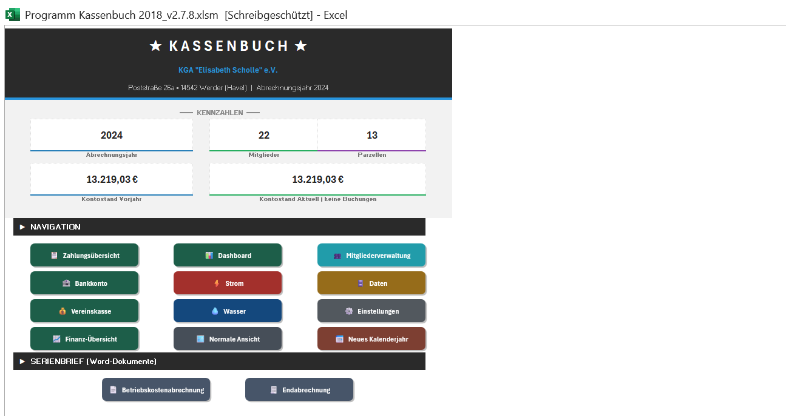

Die Startseite ist die Schaltzentrale. Sie öffnet sich beim Start der Arbeitsmappe und zeigt oben die wichtigsten Kennzahlen und darunter die Navigation.

## 3.1 Kennzahlen

Der Kopfbereich nennt das aktuelle Abrechnungsjahr, die Zahl der Mitglieder, die Zahl der verpachteten Parzellen sowie den Kontostand des Vorjahres und den aktuellen Kontostand. Diese Werte werden bei jedem Öffnen neu berechnet. Sie sind ein guter erster Plausibilitätstest: Stimmt die Mitgliederzahl nicht, fehlt meist ein Eintrag in der Mitgliederliste.

## 3.2 Navigation

Die Kacheln führen direkt zum jeweiligen Blatt. Sie sind nach Themen gruppiert und farblich unterschieden:

| Kachel | Farbe | Führt zu |
| --- | --- | --- |
| Zahlungsübersicht | dunkelgrün | Soll-Ist-Vergleich je Mitglied und Monat |
| Dashboard | dunkelgrün | Matrixansicht aller Zahlungen |
| Bankkonto | dunkelgrün | Kontobewegungen und CSV-Import |
| Vereinskasse | dunkelgrün | Barkasse |
| Finanz-Übersicht | dunkelgrün | Jahresauswertung |
| Mitgliederverwaltung | helles Petrol | Mitglieder anlegen und pflegen |
| Strom | rot | Stromzähler |
| Wasser | blau | Wasserzähler |
| Daten | bernstein | Kategorien und Zuordnungstabelle |
| Einstellungen | grau | Grundeinrichtung |
| Neues Kalenderjahr | terrakotta | Jahreswechsel |
| Normale Ansicht | blaugrau | Excel-Menüband und Spaltenköpfe einblenden |

Die beiden Kacheln im unteren Bereich erzeugen Serienbriefe für die Betriebskostenabrechnung und die Endabrechnung.

> Die Kachel "Normale Ansicht" brauchen Sie, wenn Sie ausnahmsweise mit den Excel-Bordmitteln arbeiten wollen, etwa um eine Spalte zu verbreitern. Sie blendet Menüband, Zeilen- und Spaltenköpfe wieder ein. Beim nächsten Start ist die aufgeräumte Ansicht zurück.

## 3.3 Zurück zur Startseite

Auf jedem Blatt sitzt oben links eine Schaltfläche "Home". Sie führt immer zur Startseite zurück.

---

# 4 Grundeinrichtung auf dem Blatt Einstellungen

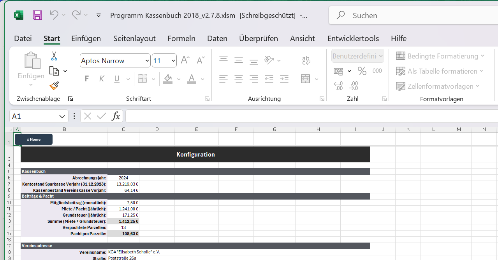

Das Blatt **Einstellungen** ist die wichtigste Stellschraube des Programms. Alles, was das Programm über Beträge und Fristen weiß, steht hier.

## 4.1 Vereinsdaten und Jahreswerte

Im oberen Bereich stehen in Spalte B die Bezeichnungen und in Spalte C die Werte:

| Feld | Bedeutung |
| --- | --- |
| Abrechnungsjahr | Das Jahr, das gerade bearbeitet wird. Steuert Import-Prüfungen und alle Auswertungen. |
| Kontostand Sparkasse Vorjahr | Der Kontostand zum Jahreswechsel. Startwert für die Kontostandsberechnung. |
| Kassenbestand Vorjahr | Der Bestand der Barkasse zum Jahreswechsel. Wird beim Jahreswechsel automatisch übernommen. |
| Mitgliedsbeitrag monatlich | Der Beitrag je Person und Monat. |
| Miete/Pacht jährlich | Die Pacht, die der Verein insgesamt zahlt. |
| Grundsteuer jährlich | Die Grundsteuer, die der Verein insgesamt zahlt. |
| Summe | Wird berechnet aus Miete und Grundsteuer. Nicht überschreiben. |
| Verpachtete Parzellen | Anzahl der verpachteten Parzellen, 1 bis 14. |
| Pacht pro Parzelle | Wird berechnet: Summe geteilt durch Anzahl der Parzellen. |
| Vereinsname, Straße, PLZ und Ort | Erscheinen im Kopf der Startseite und in den Serienbriefen. |

> Ändern Sie das Abrechnungsjahr niemals von Hand, um ein neues Jahr zu beginnen. Dafür gibt es die Kachel "Neues Kalenderjahr", siehe Kapitel 13. Das Feld von Hand umzustellen würde die Altdaten im Blatt **Bankkonto** stehen lassen und alle Auswertungen verfälschen.

## 4.2 Die Tabelle Zahlungstermine

Darunter folgt die Tabelle **Zahlungstermine**. Sie legt für jede Kategorie fest, wie viel wann fällig ist. Ohne einen Eintrag hier kann die Zahlungsübersicht für diese Kategorie keinen Soll-Betrag bilden.

| Spalte | Feld | Bedeutung |
| --- | --- | --- |
| B | Kategorie | Muss genau so heißen wie die Kategorie auf dem Blatt **Daten**. |
| C | Soll-Betrag | Der fällige Betrag je Mitglied und Fälligkeitszeitraum. |
| D | Soll-Tag | Der Tag im Monat, bis zu dem gezahlt sein muss, 1 bis 31. |
| E | Soll-Monate | In welchen Monaten fällig ist. Entweder "alle" oder eine Liste wie "03, 06, 09, 12". |
| F | Stichtag fix | Ein fester Termin im Format TT.MM. als Alternative zu Soll-Tag und Soll-Monaten. |
| G | Vorlaufzeit | Wie viele Tage vor dem Termin eine Zahlung noch als für diesen Termin gilt. |
| H | Nachlaufzeit | Wie viele Tage nach dem Termin eine Zahlung noch als pünktlich gilt. |
| I | Säumnisgebühr | Der Betrag, der bei verspäteter Zahlung erhoben werden kann. |

### Soll-Tag und Soll-Monate oder Stichtag fix

Sie füllen entweder die Spalten D und E oder die Spalte F, nicht beides. Spalten D und E beschreiben einen wiederkehrenden Termin, etwa "jeden Monat bis zum Fünften". Spalte F beschreibt einen einzelnen festen Termin im Jahr, etwa "bis zum 31.03.".

### Vorlaufzeit und Nachlaufzeit

Diese beiden Felder sind entscheidend dafür, dass pünktliche Zahler nicht fälschlich als säumig gelten. Die Vorlaufzeit fängt Mitglieder ab, die früher zahlen als nötig. Die Nachlaufzeit lässt Zahlungen durchgehen, die wenige Tage zu spät eintreffen, etwa weil ein Wochenende dazwischen lag.

> Die Vorlaufzeit hat eine wichtige Nebenwirkung über den Jahreswechsel hinweg. Zahlt ein Mitglied den Januarbeitrag schon Ende Dezember, liegt die Zahlung im Vorjahr. Das Programm fragt in solchen Fällen nach, siehe Abschnitt 7.6.

---

# 5 Mitglieder verwalten

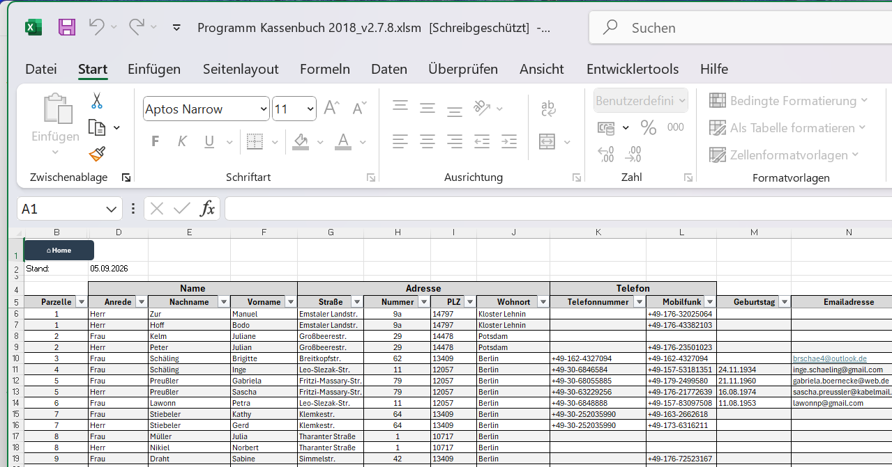

## 5.1 Das Blatt Mitgliederliste

Die Mitgliederliste enthält die Stammdaten. Die Kopfzeile steht in Zeile 5, die Daten beginnen in Zeile 6.

| Spalte | Feld | Eingabe |
| --- | --- | --- |
| A | Mitglieds-ID | automatisch |
| B | Parzelle | Auswahlliste |
| C | Seite | Auswahlliste, wird meist aus der Parzelle abgeleitet |
| D | Anrede | Auswahlliste |
| E | Nachname | von Hand |
| F | Vorname | von Hand |
| G, H | Straße und Hausnummer | von Hand |
| I, J | PLZ und Wohnort | von Hand |
| K bis N | Telefon, Mobil, Geburtstag, E-Mail | von Hand |
| O | Funktion | Auswahlliste, steuert die Zuordnungsrolle |
| P | Mitglieds- oder Pachtbeginn | von Hand |
| Q | Pachtende | von Hand |
| R | Zuordnungsschlüssel | automatisch |

### Spalte O Funktion

Die Funktion entscheidet, wie das Programm das Mitglied behandelt. Aus ihr leitet sich die Zuordnungsrolle ab, die wiederum bestimmt, ob für diese Person Beiträge erwartet werden. Ein Ehrenmitglied wird anders behandelt als ein Mitglied mit Pacht.

### Spalte P Mitglieds- oder Pachtbeginn

Dieses Datum ist wichtiger, als es aussieht. Tritt jemand mitten im Jahr ein, erwartet das Programm für die Monate davor keinerlei Zahlungen, weder Mitgliedsbeitrag noch Pacht noch Abschläge. Bleibt das Feld leer, gilt das Mitglied für das ganze Jahr als zahlungspflichtig.

### Spalte Q Pachtende

Das Gegenstück. Ab dem Monat nach dem Pachtende entstehen keine laufenden Beiträge mehr. Offen bleiben nur noch die Schlusspositionen, also die Endabrechnung und die Betriebskostenabrechnung. Wie das Programm mit ausgetretenen und verstorbenen Mitgliedern umgeht, beschreibt Abschnitt 8.6.

## 5.2 Die Mitgliederverwaltung

Die Kachel "Mitgliederverwaltung" öffnet ein Eingabefenster, in dem sich Mitglieder bequemer anlegen und ändern lassen als direkt in der Tabelle. Die Änderungen landen in derselben Mitgliederliste.

## 5.3 Partner auf einer Parzelle

Häufig sind zwei Personen auf derselben Parzelle gemeldet, etwa ein Ehepaar. Beide sind beitragspflichtig, aber oft zahlt nur eine Person für beide, und zwar vom eigenen Konto.

Das Programm erkennt diesen Fall. Wenn eine Person auf einer Parzelle einen Betrag überweist, der dem doppelten Mitgliedsbeitrag entspricht, wird der Partner als mitbezahlt gewertet. Dabei zählt die Summe aller Überweisungen dieser Person im betreffenden Monat, es muss also keine einzelne Überweisung über den vollen Betrag sein.

Ein Gemeinschaftskonto ist dafür nicht nötig.

---

# 6 Das Blatt Daten: Kategorien und Zuordnung

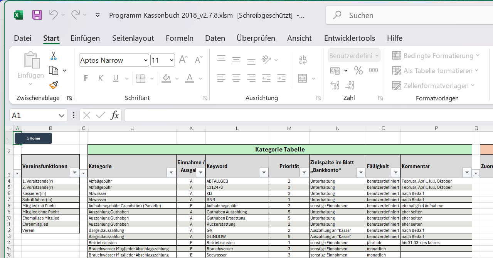

Das Blatt **Daten** ist das Gehirn der Automatik. Hier stehen zwei Tabellen, die entscheiden, wie das Programm eine Buchung versteht.

## 6.1 Die Kategorietabelle

Die Kategorietabelle steht in den Spalten J bis P und beginnt in Zeile 4. Jede Zeile ist eine Erkennungsregel.

| Spalte | Feld | Bedeutung |
| --- | --- | --- |
| J | Kategorie | Der Name der Kategorie, zum Beispiel "Mitgliedsbeitrag". |
| K | Ein/Aus | "E" für Einnahme, "A" für Ausgabe. |
| L | Schlüsselwort | Der Text, an dem die Kategorie erkannt wird. |
| M | Priorität | Rangfolge bei mehreren möglichen Treffern. Kleinere Zahl bedeutet höherer Rang. |
| N | Zielspalte | Die Überschrift der Betragsspalte auf dem Blatt **Bankkonto**. |
| O | Fälligkeit | Wie oft die Kategorie fällig wird. |
| P | Kommentar | Freitext für Ihre eigenen Notizen. |

### Mehrere Schlüsselwörter für dieselbe Kategorie

Eine Kategorie darf mehrfach vorkommen. Wenn Sie für "Mitgliedsbeitrag" drei verschiedene Schreibweisen erkennen wollen, legen Sie drei Zeilen an, alle mit demselben Namen in Spalte J und jeweils einem anderen Schlüsselwort in Spalte L. Die übrigen Angaben übernimmt das Programm aus der ersten Zeile dieser Kategorie.

### Schlüsselwörter aus mehreren Wörtern

Steht in Spalte L mehr als ein Wort, müssen alle diese Wörter im Verwendungszweck vorkommen, aber nicht unbedingt direkt hintereinander. "brauchwasser abschlag" trifft also auch auf "Abschlag Brauchwasser Februar" zu.

### Spalte N Zielspalte

Hier muss exakt der Text stehen, der auf dem Blatt **Bankkonto** in Zeile 29 als Spaltenüberschrift steht. Nur dann weiß das Programm, in welche Spalte der Betrag gehört. Einnahmen gehören in die Spalten M bis S, Ausgaben in die Spalten T bis Z.

> Ein Tippfehler in Spalte N ist die häufigste Ursache dafür, dass eine Kategorie zwar erkannt wird, der Betrag aber nirgends auftaucht. Vergleichen Sie im Zweifel Zeichen für Zeichen mit der Überschrift auf dem Blatt **Bankkonto**.

### Spalte O Fälligkeit

Die Fälligkeit steuert, welchem Zeitraum eine Zahlung zugeordnet wird. Gebräuchlich sind:

- **monatlich** für laufende Beiträge und Abschläge
- **quartalsweise** oder **vierteljährlich**
- **halbjährlich**
- **jährlich** für Pacht und ähnliche Jahresbeträge
- **einmalig** für Positionen ohne Wiederkehr

## 6.2 Die Zuordnungstabelle

Rechts daneben, in den Spalten R bis X, steht die Zuordnungstabelle. Sie verbindet eine Bankverbindung mit einem Mitglied. Ohne diese Verbindung weiß das Programm nicht, wem eine Zahlung gehört.

| Spalte | Feld | Eingabe |
| --- | --- | --- |
| R | Zuordnungsschlüssel | automatisch |
| S | IBAN | automatisch aus dem Import |
| T | Kontoname | automatisch aus dem Import |
| U | Zuordnung | von Hand: der Name, unter dem dieses Konto geführt wird |
| V | Parzelle | von Hand, sofern die Rolle es zulässt |
| W | Zuordnungsrolle | von Hand, Auswahlliste |
| X | Hinweis | von Hand |

### So füllen Sie die Tabelle

Neue Bankverbindungen trägt das Programm beim CSV-Import selbst ein. Die Spalten S und T sind dann bereits gefüllt, die Spalten U, V und W sind leer. Genau diese drei Angaben brauchen Sie.

In Spalte U tragen Sie ein, wem das Konto gehört. In Spalte W wählen Sie die Rolle. In Spalte V die Parzelle, sofern es sich um ein Mitglied handelt.

### Die Zuordnungsrollen

| Rolle | Bedeutung |
| --- | --- |
| Mitglied mit Pacht | Zahlt Mitgliedsbeitrag und Pacht. |
| Mitglied ohne Pacht | Zahlt nur den Mitgliedsbeitrag. |
| Ehrenmitglied | Von Beiträgen befreit oder ermäßigt. |
| Ehemaliges Mitglied | Ausgetreten. Siehe Abschnitt 8.6. |
| Versorger | Energieversorger, Wasserwerk und ähnliche Firmen. |
| Bank | Die Bank selbst, etwa für Kontoführungsgebühren. |
| Sonstige | Alles, was zu keiner der übrigen Rollen passt. |

> Die Rolle **Versorger** hat eine besondere Bedeutung. Kommt von einem Versorger Geld herein statt hinaus, handelt es sich fast immer um eine Rückerstattung oder Gutschrift. Das Programm schlägt in diesem Fall von sich aus eine passende Erstattungskategorie vor.

## 6.3 Wie die automatische Kategoriefindung arbeitet

Sie müssen die Mechanik nicht kennen, um mit dem Programm zu arbeiten. Wenn die Automatik aber einmal etwas anderes tut, als Sie erwarten, hilft es sehr zu verstehen, wie sie zu ihrem Ergebnis kommt.

### Schritt 1: Text vereinheitlichen

Zunächst wird der Verwendungszweck vereinheitlicht: Großbuchstaben werden zu Kleinbuchstaben, Umlaute werden aufgelöst, Satzzeichen und Mehrfachleerzeichen verschwinden. Zusätzlich kennt das Programm einige feste Gleichsetzungen. So gilt "fixe kosten" als "fixkosten" und "amzn" als "amazon".

### Schritt 2: Schlüsselwörter suchen

Jede Regel der Kategorietabelle wird gegen diesen bereinigten Text geprüft. Die Suche läuft in drei Stufen. Zuerst wird genau gesucht. Führt das zu keinem Treffer, wird ohne Leerzeichen gesucht. Führt auch das zu nichts, wird auf den Wortstamm verkürzt gesucht, allerdings nur bei ausreichend langen Schlüsselwörtern, damit keine zufälligen Treffer entstehen.

### Schritt 3: Punkte vergeben

Jeder Treffer bekommt Punkte. Ein Treffer bringt zunächst 100 Punkte. Dazu kommen Zuschläge:

- Rang aus Spalte Priorität, bis zu 72 Punkte
- die Zuordnungsrolle ist bekannt: 20 Punkte
- Einnahme oder Ausgabe passt zum Vorzeichen: 15 Punkte
- langes Schlüsselwort: 5 bis 20 Punkte
- der Verwendungszweck besteht nur aus dem Schlüsselwort: 10 Punkte
- je Wort eines mehrteiligen Schlüsselworts: 5 Punkte
- der Betrag passt genau zum Soll-Betrag: 25 Punkte, ein Vielfaches davon: 15 Punkte
- die Zahlung liegt im erwarteten Zeitfenster: weiterer Zuschlag

Ein Treffer, der nur über die tolerante Suche der Stufen zwei oder drei zustande kam, bekommt 15 Punkte Abzug und gilt als unsicher.

### Schritt 4: Entscheiden

Liegt die beste Kategorie mindestens 20 Punkte vor der zweitbesten, gilt sie als eindeutig. Die Zelle wird **grün** und der Betrag sofort verteilt.

Ist der Vorsprung kleiner oder kam der Treffer nur über die tolerante Suche zustande, wird die Kategorie **gelb** vorgeschlagen. Sie müssen sie bestätigen. Erst danach wird der Betrag verteilt.

Findet sich gar nichts, bleibt die Zelle **rot** und Sie wählen die Kategorie selbst aus.

### Was Sie tun können, damit mehr grün wird

Die Erkennung lebt von den Schlüsselwörtern. Wenn eine Buchung regelmäßig gelb oder rot bleibt, schauen Sie sich den Verwendungszweck an und legen Sie dafür eine zusätzliche Zeile in der Kategorietabelle an. Ein einziges gut gewähltes Schlüsselwort erspart über das Jahr viele Handgriffe.

Ebenso hilfreich ist eine gepflegte Zuordnungstabelle: Sobald die Rolle bekannt ist, bekommt jede Regel 20 Punkte zusätzlich, und die Entscheidung wird deutlich eindeutiger.

---

# 7 Das Blatt Bankkonto

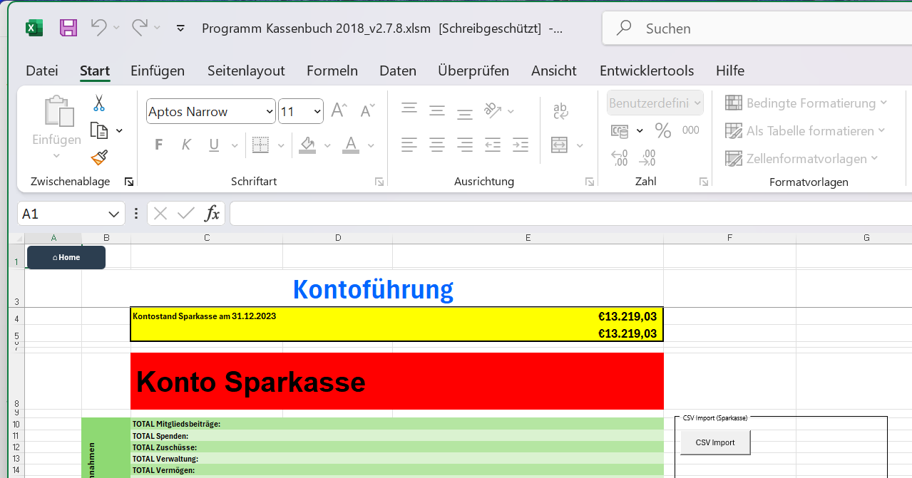

Auf dem Blatt **Bankkonto** landen alle Kontobewegungen. Die Kopfzeile steht in Zeile 29, die Buchungen beginnen in Zeile 30.

## 7.1 Die Spalten

| Spalte | Feld | Eingabe |
| --- | --- | --- |
| A | Datum | automatisch aus der CSV-Datei |
| B | Betrag | automatisch |
| C | Auftraggeber oder Empfänger | automatisch |
| D | IBAN | automatisch |
| E | Verwendungszweck | automatisch |
| F | Buchungsart | automatisch |
| G | Im Auswertungsmonat | Formel |
| H | **Kategorie** | Auswahlliste, von Hand korrigierbar |
| I | **Monat/Periode** | Auswahlliste, von Hand korrigierbar |
| J | Interne Nummer | vom Programm vergeben |
| K | Status | automatisch |
| L | Bemerkung | von Hand |
| M bis S | Einnahmen nach Kategorie | automatisch verteilt |
| T bis Z | Ausgaben nach Kategorie | automatisch verteilt |

Die beiden Spalten, auf die es ankommt, sind H und I. Alles andere kommt entweder aus der Bank oder entsteht daraus.

## 7.2 Der CSV-Import

### Welche Datei das Programm erwartet

Das Programm liest den Standardexport der Sparkasse: eine CSV-Datei mit Semikolon als Trennzeichen, UTF-8-Kodierung und einer Kopfzeile. Beträge stehen mit Komma als Dezimaltrennzeichen und gegebenenfalls mit dem Zusatz "EUR".

Aus der Datei verwendet das Programm das Buchungsdatum, die Buchungsart, den Verwendungszweck, den Namen des Zahlungspartners, dessen IBAN und den Betrag.

Sie müssen die Datei nicht vorbereiten. Laden Sie sie so herunter, wie das Online-Banking sie anbietet.

### Der Ablauf

Klicken Sie auf dem Blatt **Bankkonto** auf die Schaltfläche für den Import und wählen Sie die CSV-Datei aus. Danach läuft der Import ohne weitere Eingriffe durch:

1. Das Programm prüft, ob das Jahr in der Datei zum eingestellten Abrechnungsjahr passt, und fragt nach, wenn nicht.
2. Bereits vorhandene Buchungen werden erkannt und nicht doppelt eingelesen. Als Erkennungsmerkmal dienen Datum, Betrag, IBAN und Verwendungszweck zusammen.
3. Neue Bankverbindungen werden in die Zuordnungstabelle auf dem Blatt **Daten** eingetragen.
4. Die Kategoriefindung läuft über alle neuen Zeilen.
5. Monat und Periode werden gesetzt.
6. Die Beträge werden in die Spalten M bis Z verteilt.
7. **Zahlungsübersicht** und **Dashboard** werden aktualisiert.

### Die Meldungen am Ende

Erst wenn der gesamte Durchlauf fertig ist, meldet sich das Programm. Es sammelt alle offenen Punkte und zeigt sie in einer einzigen Mitteilung, statt Sie während des Laufs mehrfach zu unterbrechen.

Gibt es offene Punkte, springt der Cursor anschließend auf die erste Stelle, die Ihre Angabe braucht. Sie können sofort mit dem Ausfüllen beginnen.

> Der Import bricht nicht mehr ab, wenn Angaben fehlen. Er läuft immer vollständig durch. Fehlende Angaben werden gesammelt und am Ende gemeldet. Das war früher anders und ist der wichtigste Unterschied zu älteren Fassungen des Programms.

### Einen Monat übersprungen

Bevor die Daten eingetragen werden, prüft das Programm, ob zwischen dem ersten und dem letzten Monat mit Buchungen ein Monat ganz ohne Buchungen bliebe. Ist das der Fall, meldet es sich:

> Zwischen den Kontoauszügen fehlt ein Monat.

Der Grund für die Rückfrage: Ohne Buchungen für den fehlenden Monat sieht es in der Zahlungsübersicht so aus, als hätte in diesem Zeitraum niemand gezahlt. Sie haben die Wahl, jetzt trotzdem zu importieren oder abzubrechen und den fehlenden Auszug zuerst zu holen. Bei Abbruch wird nichts eingetragen.

Wenn Sie einen Monat auslassen und später nachholen, funktioniert die Kategoriefindung für den nachgereichten Monat genauso wie für alle anderen. Manuelle Korrekturen, die Sie in anderen Monaten vorgenommen haben, bleiben dabei unangetastet: Das Programm überschreibt weder grün markierte Kategorien noch von Hand gesetzte Perioden.

## 7.3 Die Ampel in Spalte H

| Farbe | Bedeutung | Was zu tun ist |
| --- | --- | --- |
| grün | eindeutig erkannt oder von Ihnen bestätigt | nichts |
| gelb | Vorschlag, noch nicht sicher | prüfen und bestätigen oder ändern |
| rot | nicht erkannt | Kategorie auswählen |

Grün bedeutet ausdrücklich auch "von Hand festgelegt". Eine grüne Zelle wird vom Programm nie wieder verändert. Wenn Sie also eine Kategorie einmal selbst gesetzt haben, bleibt sie so, auch wenn Sie später erneut importieren.

Sobald Sie eine gelbe Kategorie bestätigen, wird der Betrag in die passende Spalte verteilt und die Zahlungsübersicht zieht nach.

## 7.4 Monat und Periode in Spalte I

Spalte I sagt, für welchen Zeitraum eine Zahlung gilt. Das ist nicht dasselbe wie das Buchungsdatum. Eine am 28. Januar eingehende Zahlung kann für den Januar gelten oder bereits für den Februar.

Das Programm entscheidet anhand der Angaben aus der Tabelle **Zahlungstermine**: des Soll-Tags, der Vorlaufzeit und der Nachlaufzeit. Ist die Lage eindeutig, wird der Monat gesetzt. Ist sie es nicht, fragt das Programm nach.

Sie können den Wert jederzeit selbst ändern. Auch hier gilt: Was Sie von Hand setzen, bleibt stehen.

### Abschlagszahlungen zu festen Terminen

Trägt eine Kategorie in Spalte E der Zahlungstermine eine Monatsliste wie `03, 06, 09`, dann sind die Termine verabredet. Geht die Zahlung in einem dieser Monate ein, ist die Periode eindeutig, und das Programm fragt nicht nach. Eine Abschlagszahlung, die am 25. März eingeht, gilt für den März, auch wenn die Kategorie erst zum Monatsletzten fällig ist.

Nur Kategorien mit leerer Spalte E gelten in jedem Monat. Bei ihnen bleibt das Monatsende mehrdeutig, und es kann zu der Rückfrage im folgenden Abschnitt kommen.

### Wenn Sie das Blatt mit offenen Angaben verlassen

Sind noch Kategorien in Spalte H oder Monate in Spalte I offen und Sie wechseln auf ein anderes Blatt, meldet sich das Programm:

> Bankkonto noch nicht vollständig

Der Wechsel wird nicht verhindert. Der Hinweis nennt die Zeile mit der ersten offenen Stelle und erscheint erst wieder, wenn Sie am Bankkonto etwas geändert haben.

## 7.5 Über-pünktliche Daueraufträge

Manche Mitglieder haben bei ihrer Bank einen Dauerauftrag eingerichtet, der am Monatsende für den Folgemonat zahlt. Für eine Kategorie, die ohnehin erst zum Monatsletzten fällig ist, lässt sich am Buchungsdatum allein nicht erkennen, ob die Zahlung für den laufenden oder den nächsten Monat gedacht ist.

Solange Vorjahresdaten vorliegen, klärt sich das von selbst. Im ersten Jahr fehlen diese Daten aber. Deshalb fragt das Programm in diesem Fall einmalig nach:

> Zahlung am Monatsende, für welchen Monat gilt sie?

Sie bekommen dabei den Kontoinhaber, die Kategorie, den Betrag und das Eingangsdatum genannt und haben drei Möglichkeiten:

- **Ja**: Das Mitglied zahlt über-pünktlich. Alle Monatsend-Zahlungen dieses Mitglieds in dieser Kategorie werden um einen Monat weitergeschoben.
- **Nein**: Die Zahlung gilt für den laufenden Monat.
- **Abbrechen**: Die übrigen Fälle werden übersprungen und beim nächsten Mal erneut gefragt.

Die Frage kommt je Mitglied und Kategorie nur einmal. Danach kennt das Programm das Muster und wendet es von allein an.

> Diese Rückfrage klärt einen Fehler, der sich sonst durch das ganze Jahr zieht. Wird eine Ende Dezember geleistete Januarzahlung fälschlich dem Januar zugeordnet, fehlt scheinbar die Februarzahlung, obwohl sie Ende Januar eingegangen ist. Der Versatz setzt sich Monat für Monat fort. Beantworten Sie die Frage deshalb sorgfältig.

## 7.6 Zahlungen aus dem Vorjahr

Fehlt im Januar eine Zahlung, kann sie innerhalb der Vorlaufzeit bereits im Dezember des Vorjahres geleistet worden sein. Liegen für Oktober bis Dezember keine Daten vor, kann das Programm das nicht nachsehen und fragt Sie.

Die Frage nennt das Mitglied, die Kategorie, den Betrag und den Zeitraum. Bestätigen Sie die Zahlung, werden Sie anschließend nach dem genauen Zahlungsdatum und dem Betrag gefragt. Aus diesen Angaben kann sich auch ein Guthaben ergeben, wenn mehr gezahlt wurde als fällig war.

## 7.7 Eine Zahlung einem anderen Mitglied zuordnen

Manchmal zahlt jemand anderes als das Mitglied selbst. Der Nachbar überweist für eine fremde Parzelle mit. Im Todesfall begleicht ein Angehöriger die Endabrechnung von seinem eigenen Konto. In beiden Fällen passt die IBAN nicht zum Mitglied, und das Programm kann die Zahlung nicht von allein zuordnen.

Dafür gibt es auf dem Blatt **Bankkonto** rechts im Bedienfeld zwei Schaltflächen.

### "Zahlung zuordnen"

1. Markieren Sie eine beliebige Zelle in der Zeile der betreffenden Buchung.
2. Klicken Sie auf "Zahlung zuordnen".
3. Das Programm zeigt Ihnen Datum, Betrag, Zahler und Verwendungszweck zur Kontrolle.
4. Geben Sie einen Teil des Namens des Mitglieds ein, dem die Zahlung gutgeschrieben werden soll. Bei mehreren Übereinstimmungen erhalten Sie eine nummerierte Auswahl.
5. Tragen Sie optional eine Begründung ein, zum Beispiel "Erbfall, Zahlung durch Tochter".

Die Zahlung zählt ab sofort für das ausgewählte Mitglied. In der Spalte Bemerkung erscheint ein entsprechender Vermerk, damit die Zuordnung nachvollziehbar bleibt.

### "Zuordnungen"

Diese Schaltfläche listet alle bestehenden Sonderzuordnungen auf. Sie können eine davon über ihre Nummer wieder aufheben.

> Eine Sonderzuordnung überschreibt die IBAN-Erkennung nur für diese eine Buchung. Alle anderen Zahlungen desselben Zahlers bleiben unberührt. Die Zuordnung ist dauerhaft gespeichert und übersteht auch einen erneuten Import.

Nach einer Änderung sollten Sie die Zahlungsübersicht neu aufbauen lassen, damit das Ergebnis dort ankommt. Das Programm bietet das von sich aus an.

---

# 8 Die Zahlungsübersicht

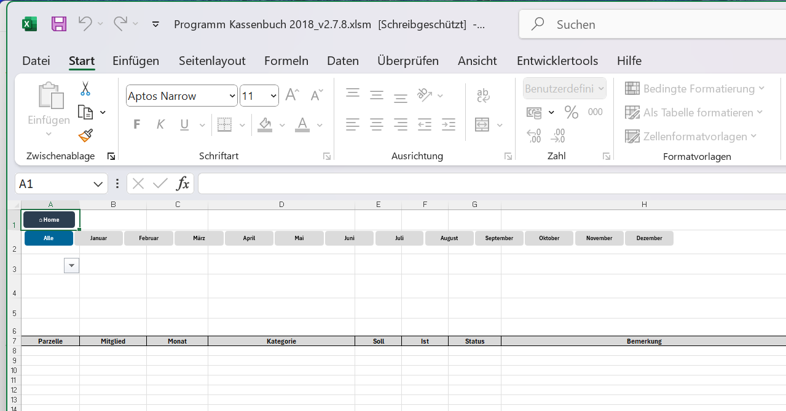

Die **Zahlungsübersicht** ist das Kontrollblatt. Sie vergleicht für jede Kombination aus Mitglied, Monat und Kategorie den Soll-Betrag mit dem tatsächlich Gezahlten.

## 8.1 Die Spalten

| Spalte | Feld | Eingabe |
| --- | --- | --- |
| A | Parzelle | automatisch |
| B | Mitglied | automatisch |
| C | Monat | automatisch aus Spalte I des Blattes **Bankkonto** |
| D | Kategorie | automatisch |
| E | **Soll** | meist automatisch; bei veränderlichen Beträgen von Hand |
| F | **Ist** | von Hand korrigierbar |
| G | Status | Ampel, von Hand überschreibbar |
| H | Bemerkung | von Hand |
| I | Guthaben | automatisch |

### Spalte C Monat

Der Monat kommt immer aus Spalte I des Blattes **Bankkonto**. Das Bankkonto ist die maßgebliche Quelle. Wenn in der Zahlungsübersicht ein Monat nicht stimmt, ändern Sie ihn nicht hier, sondern auf dem Blatt **Bankkonto**.

Damit das auch dann gilt, wenn Sie eine Periode ändern, während noch andere Zuordnungen offen sind, merkt sich das Programm bei jedem Aufbau den Stand des Bankkontos. Weicht er ab, sobald Sie die Zahlungsübersicht öffnen, wird sie zuerst neu aufgebaut. Das kann einen Moment dauern und geschieht ohne weitere Meldung.

### Spalte E Soll

Hat eine Kategorie in der Tabelle **Zahlungstermine** einen festen Betrag, wird er hier eingesetzt und ist gesperrt. Bei Kategorien ohne festen Betrag bleibt die Zelle leer und hellgelb hinterlegt. Diese Zellen sind für Sie zum Ausfüllen gedacht.

### Spalte F Ist

Normalerweise füllt das Programm diese Spalte aus den Buchungen des Blattes **Bankkonto**. Sie können den Wert überschreiben, wenn Sie einen Sonderfall abbilden müssen.

### Wenn Sie das Blatt mit leeren Feldern verlassen

Fehlen noch Beträge in Spalte E oder Spalte F und Sie wechseln auf ein anderes Blatt, meldet sich das Programm:

> Zahlungsübersicht noch nicht vollständig

Die Meldung nennt, wie viele Zeilen betroffen sind und wo die erste offene Stelle steht; danach springt der Cursor dorthin. Der Wechsel wird nicht verhindert, und der Hinweis erscheint erst wieder nach einer Änderung an der Übersicht.

## 8.2 Die Sortierung

Die Übersicht wird nach jedem Aufbau in dieser Reihenfolge sortiert: zuerst nach **Parzelle**, dann nach **Monat**, dann nach **Name**, zuletzt nach **Kategorie**.

Der Monat wird dabei zeitlich sortiert, nicht alphabetisch. Sonst stünde April vor Januar.

## 8.3 Ehrenmitglieder

Ein Ehrenmitglied ist vom Mitgliedsbeitrag befreit. Es verschwindet deshalb aber nicht aus der Übersicht, sondern wird weiterhin geführt: mit Soll und Ist von 0,00, dem Status GRÜN und der Bemerkung

> Ehrenmitglied vom Mitgliedsbeitrag befreit

So sind alle Mitglieder vollständig aufgelistet, und Sie sehen auf einen Blick, dass hier kein Beitrag fehlt, sondern keiner geschuldet wird.

## 8.4 Die Ampel in Spalte G

| Farbe | Bedeutung |
| --- | --- |
| GRÜN | vollständig und rechtzeitig bezahlt |
| GELB | teilweise bezahlt oder verspätet |
| ROT | nicht bezahlt |

Ein grüner Status wird nur gesetzt, wenn er auch belegt ist: entweder durch einen Betrag aus dem Blatt **Bankkonto** oder durch eine ausdrücklich bestätigte Vorjahreszahlung. Eine frühere Eingabe ohne Beleg wird nicht mehr blind übernommen. In solchen Fällen erscheint in Spalte H der Hinweis "Frühere Angabe ohne Nachweis - Zahlung nicht belegt".

## 8.5 Säumnisgebühren

Ist eine Zahlung verspätet und in der Tabelle **Zahlungstermine** eine Säumnisgebühr hinterlegt, wird das in der Bemerkung vermerkt. Mit der Schaltfläche "Säumnisgebühr quittieren" bestätigen Sie für die markierte Zeile, dass die Gebühr erhoben wurde.

## 8.6 Guthaben

Zahlt ein Mitglied mehr als fällig, entsteht ein Guthaben. Es erscheint in Spalte I.

Ein Guthaben gehört dem Mitglied, nicht der Kategorie. Es kann deshalb zwischen Kategorien verschoben oder aufgeteilt werden. Das gilt auch für die Betriebskostenabrechnung, die Pacht und die Endabrechnung.

Bleibt eine Zahlung offen und ist Guthaben vorhanden, fragt das Programm, ob es verrechnet werden soll. Alle Vorschläge erscheinen dabei in **einem** Fenster, nicht nacheinander. Ihre Antwort wird gespeichert, auch ein Nein: Dieselbe Position wird kein zweites Mal vorgeschlagen.

Deckt das Guthaben den offenen Betrag vollständig, entsteht **keine Säumnisgebühr**. Eine bereits vermerkte Gebühr wird in diesem Fall wieder entfernt. Nur wenn das Guthaben nicht ausreicht, bleibt die Gebühr bestehen.

### Abgleich mit der Auszahlung

Wird ein Guthaben ausgezahlt, muss die Auszahlung dem Guthaben entsprechen. Das Programm summiert deshalb das gesamte Guthaben eines Mitglieds über alle Kategorien und vergleicht es mit den Buchungen der Kategorie "Auszahlung Guthaben" für dieses Mitglied.

Weicht beides um mehr als einen Cent voneinander ab, erhalten Sie einen Hinweis und in Spalte H einen Vermerk. Prüfen Sie dann, ob die Auszahlung vollständig war und ob sie der richtigen Kategorie zugeordnet wurde.

## 8.7 Eine gespeicherte Entscheidung zurücknehmen

Einmal getroffene Entscheidungen, etwa die Bestätigung einer Vorjahreszahlung, werden dauerhaft gespeichert und bei jedem Neuaufbau der Übersicht wieder angewendet. Das ist gewollt, denn sonst müssten Sie dieselbe Frage immer wieder beantworten.

Haben Sie sich vertan, lässt sich eine solche Entscheidung zurücknehmen. Markieren Sie die betroffenen Zeilen in der Zahlungsübersicht und rufen Sie die Funktion "Gespeicherte Entscheidung zurücknehmen" auf. Die gespeicherten Angaben werden gelöscht und die Übersicht neu berechnet.

## 8.8 Austritt, Todesfall und Erbfall

Ein Mitglied verschwindet nicht schlagartig aus der Zahlungsübersicht, sobald die Pacht endet. Das wäre unpraktisch, denn gerade dann sind oft noch Beträge offen.

### Im Jahr des Austritts

Bis zum Austrittsmonat gilt die gewohnte Beitragspflicht. Für die Monate danach entstehen keine laufenden Beiträge mehr; es bleiben nur noch die Schlusspositionen stehen, also **Endabrechnung**, **Betriebskostenabrechnung** und die **Auszahlung eines Guthabens**.

Alle Zeilen des Mitglieds aus diesem Jahr bleiben sichtbar, auch wenn alles bezahlt ist. Die Zahlungen gehören zur Jahresabrechnung und sollen nachvollziehbar bleiben.

### In den Jahren danach

Ist ein Mitglied bereits vor dem Abrechnungsjahr ausgeschieden, erscheinen nur noch die Schlusspositionen. Und zwar so lange, wie das Mitglied entweder noch etwas schuldet oder noch ein Guthaben zu bekommen hat.

Sobald alles ausgeglichen ist, verschwindet das Mitglied vollständig aus der Übersicht. Das geschieht beim nächsten Neuaufbau von selbst, Sie müssen nichts unternehmen.

Maßgeblich ist dabei das Mitglied als Ganzes, nicht die einzelne Zeile. Ist auch nur eine Position offen, bleibt der komplette Block sichtbar, damit der Zusammenhang erhalten bleibt.

### Der Todesfall

Verstirbt ein Mitglied, sind es meist die Angehörigen, die die Endabrechnung begleichen, und zwar vom eigenen Konto. Die Zahlung lässt sich deshalb nicht über die IBAN zuordnen.

Gehen Sie so vor:

1. Tragen Sie in der Mitgliederliste in Spalte Q das Pachtende ein.
2. Setzen Sie in der Zuordnungstabelle auf dem Blatt **Daten** die Zuordnungsrolle auf "Ehemaliges Mitglied".
3. Importieren Sie den Kontoauszug wie gewohnt.
4. Ordnen Sie die Zahlung des Angehörigen über die Schaltfläche "Zahlung zuordnen" dem verstorbenen Mitglied zu, siehe Abschnitt 7.7. Tragen Sie als Begründung zum Beispiel "Erbfall" ein.

Die Zahlung zählt danach für das verstorbene Mitglied. Sobald Endabrechnung und Betriebskosten ausgeglichen sind und kein Guthaben mehr offen ist, wird das Mitglied automatisch ausgeblendet.

> Bleibt nach zwei Jahren noch etwas offen, blendet das Programm das Mitglied ebenfalls aus. Eine Forderung, die so lange nicht beglichen wurde, gehört in die **Mitgliederhistorie** und nicht mehr in die laufende Jahresübersicht.

---

# 9 Das Dashboard Mitgliederzahlungen

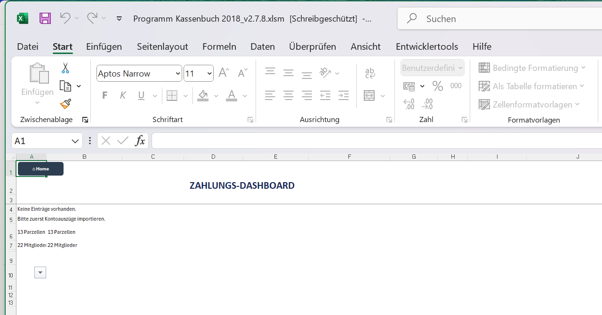

Das Dashboard verdichtet die Zahlungsübersicht zu einer Matrix. Oben stehen Kennzahlen, darunter eine Tabelle mit den Mitgliedern in den Zeilen und den Monaten in den Spalten.

Das Dashboard enthält keine eigenen Eingabefelder. Es wird nach jedem Import und nach jeder Änderung an einer Kategorie oder Zuordnungsrolle neu aufgebaut. Alles, was Sie hier sehen, ändern Sie an der Quelle, also auf dem Blatt **Bankkonto** oder in der **Zahlungsübersicht**.

Unter der Matrix folgen drei Tabellen:

**Verzugsdetails** listen jede offene oder verspätete Position mit Mitglied, Parzelle, Monat, Kategorie und Betrag. Die letzte Spalte J trägt die Bemerkung. Lange Bemerkungen werden umbrochen, die Zeile wächst mit, und die farbige Markierung umfasst den gesamten Text.

**Säumnisgebühren** zeigen, für welche Position eine Gebühr angefallen ist.

**Guthaben** führt jedes bestehende Guthaben mit Parzelle, Mitglied, Monat, Kategorie, Soll, geleisteter Zahlung, ursprünglich entstandenem Guthaben und aktuellem Restguthaben. Die Tabelle gibt damit jederzeit den Stand aus Bankkonto und Zahlungsübersicht wieder: ob ein Guthaben aufgebraucht ist, ob ein Rest bleibt oder ob trotz verbrauchtem Guthaben noch Schulden offen sind. Unten steht die Summe aller Restguthaben.

---

# 10 Die Vereinskasse

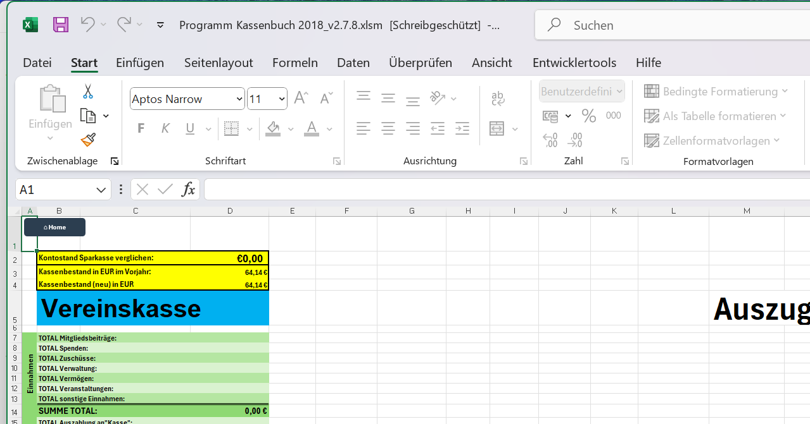

Die **Vereinskasse** führt die Barkasse. Anders als das Blatt **Bankkonto** wird sie von Hand gefüllt, denn Bargeld hat keinen Kontoauszug.

Die Kopfzeile steht in Zeile 26, die Buchungen beginnen in Zeile 27.

| Spalte | Feld |
| --- | --- |
| B | Datum |
| C | Beschreibung |
| D | Name |
| E | Betrag |
| F | Interne Nr. (KA) |

Positive Beträge sind Einnahmen, negative Beträge sind Ausgaben. Der Kassenbestand wird oben im Blatt fortlaufend berechnet und beim Jahreswechsel als Anfangsbestand ins neue Jahr übernommen.

## 10.1 Bargeld vom Konto in die Kasse

Heben Sie Geld vom Vereinskonto ab, um die Barkasse aufzufüllen, dann ist das keine Ausgabe des Vereins. Das Geld wechselt nur den Ort. Deshalb bekommt eine solche Buchung **keine BK-Nummer**.

Sobald die Buchung auf dem Blatt **Bankkonto** die Kategorie *Bargeldauszahlung* trägt, legt das Programm von selbst den passenden Eintrag in der Vereinskasse an und vergibt auf beiden Blättern **dieselbe KA-Nummer**. Diese eine Nummer ist der Querverweis: Wer die Abhebung auf dem Bankkonto sieht, findet unter derselben Nummer den Eingang in der Kasse.

Die Beschreibung in der Vereinskasse lautet dann zum Beispiel:

> Bargeldauszahlung an Vereinskasse vom 22.05.2024

Die laufenden BK-Nummern der übrigen Ausgaben bleiben davon unberührt und zählen lückenlos weiter.

---

# 11 Strom und Wasser

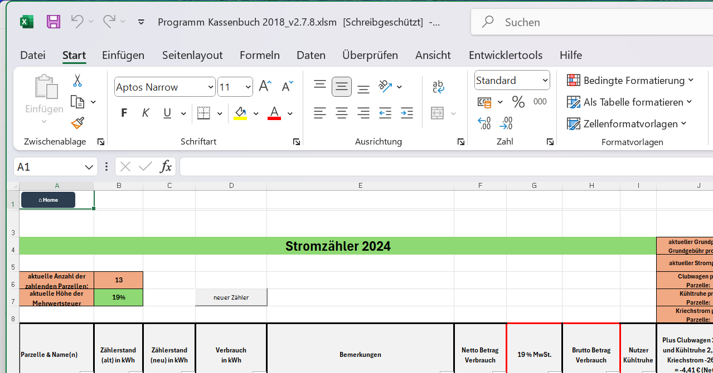

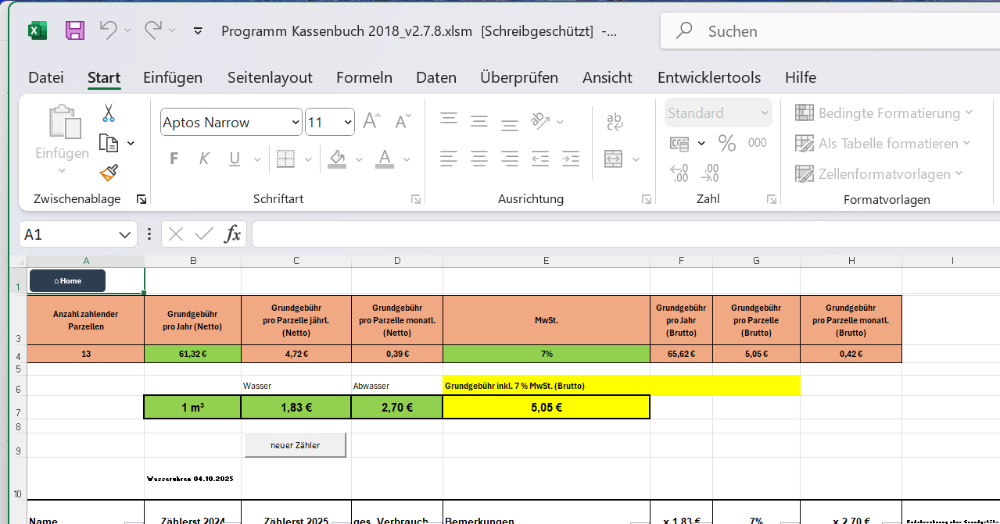

Die Blätter **Strom** und **Wasser** führen die Zählerstände je Parzelle. Beide sind gleich aufgebaut.

## 11.1 Zählerstände eintragen

| Spalte | Feld | Eingabe |
| --- | --- | --- |
| A | Parzelle oder Gerät | vorgegeben |
| B | Zählerstand Anfang | von Hand |
| C | Zählerstand Ende | von Hand |
| D | Verbrauch | berechnet |
| E | Bemerkung | von Hand |

Der Verbrauch ergibt sich aus der Differenz zwischen Endstand und Anfangsstand. Beim Strom wird in Kilowattstunden gerechnet, beim Wasser in Kubikmetern.

Auf dem Blatt **Strom** gibt es zusätzlich Felder für den Arbeitspreis und die Umschaltung zwischen Netto- und Bruttobetrachtung.

## 11.2 Zählerwechsel

Wird ein Zähler getauscht, reicht die einfache Differenz nicht mehr aus: Der alte Zähler hört bei einem bestimmten Stand auf, der neue fängt bei einem anderen an.

Für diesen Fall gibt es die Schaltfläche für den Zählerwechsel. Sie öffnet ein Eingabefenster, in dem Sie Parzelle, Wechseldatum, Endstand des alten Zählers und Anfangsstand des neuen Zählers eintragen.

Das Programm schreibt den Vorgang in das Blatt **Zaehlerhistorie** und rechnet den Verbrauch danach korrekt über beide Zähler zusammen: Es addiert den Verbrauch des alten Zählers bis zum Wechsel zum Verbrauch des neuen Zählers ab dem Wechsel.

> Tragen Sie einen Zählerwechsel immer über diese Schaltfläche ein und nie durch Überschreiben der Zählerstände. Sonst geht der Verbrauch bis zum Wechseltag verloren.

---

# 12 Die Finanz-Übersicht

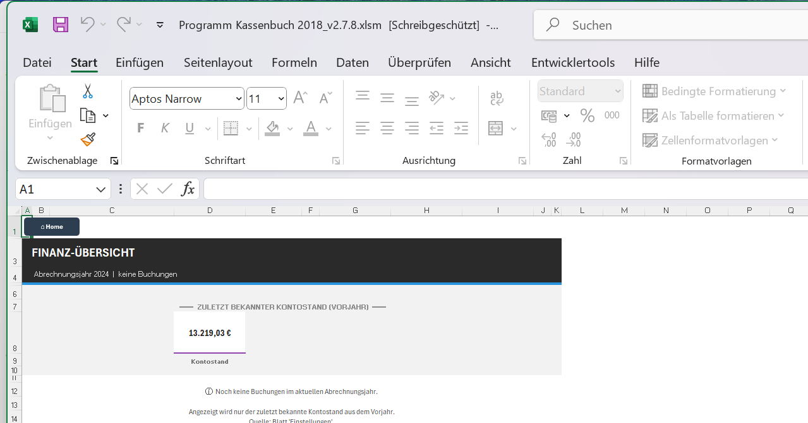

Die **Finanz-Übersicht** wertet das Jahr aus. Sie wird vollständig neu erzeugt, wenn Sie sie aufrufen, und enthält keine Eingabefelder.

Über der Tabelle stehen ein Monatsfilter und zwei Schaltflächen: "Erweiterte Filter" öffnet einen Dialog mit weiteren Einschränkungen, "zurücksetzen" stellt die vollständige Ansicht wieder her.

---

# 13 Der Jahreswechsel

Der Jahreswechsel ist der einzige Vorgang im Programm, der Daten löscht. Nehmen Sie sich dafür Zeit und arbeiten Sie die Punkte der Reihe nach ab.

## 13.1 Vorbereitung

Schließen Sie das alte Jahr ab, bevor Sie den Jahreswechsel starten:

- Alle Kontoauszüge bis Dezember sind importiert.
- In der Zahlungsübersicht ist keine Zeile mehr ungeklärt.
- Die Zählerstände zum Jahresende sind eingetragen.
- Der Kassenbestand der Vereinskasse stimmt.

## 13.2 Der Ablauf

Klicken Sie auf der Startseite auf "Neues Kalenderjahr". Das Programm führt Sie durch folgende Schritte:

1. **Bestätigung.** Sie sehen das alte und das neue Jahr und können abbrechen. Bis hierher ändert sich nichts.
2. **Archivierung.** Sie wählen einen Speicherort, an den eine vollständige Kopie der Arbeitsmappe gesichert wird. Schlägt das fehl, bricht der Vorgang ab, ohne etwas zu ändern.
3. **Kassenbestand übernehmen.** Der Endbestand der Vereinskasse wird zum Anfangsbestand des neuen Jahres.
4. **Bankkonto leeren.** Alle Buchungen werden gelöscht, mit einer wichtigen Ausnahme: Buchungen aus Oktober bis Dezember des alten Jahres bleiben stehen. Genau diese Daten braucht das Programm, um im neuen Januar die über-pünktlichen Zahler zu erkennen.
5. **Vereinskasse leeren**, nach derselben Regel.
6. **Auswertungen leeren.** Zahlungsübersicht, Dashboard und Finanz-Übersicht werden geleert.
7. **Abrechnungsjahr umstellen** auf das neue Jahr.

## 13.3 Was erhalten bleibt

Die Mitgliederliste, die Zuordnungstabelle, die Kategorien, die Einstellungen und die Zählerstände bleiben vollständig erhalten. Sie richten das Programm also nur einmal ein.

> Die Sicherungskopie aus Schritt 2 ist Ihr einziger Weg zurück. Legen Sie sie an einen Ort, den Sie wiederfinden, und benennen Sie sie nach dem abgeschlossenen Jahr.

---

# 14 Die Mitgliederhistorie

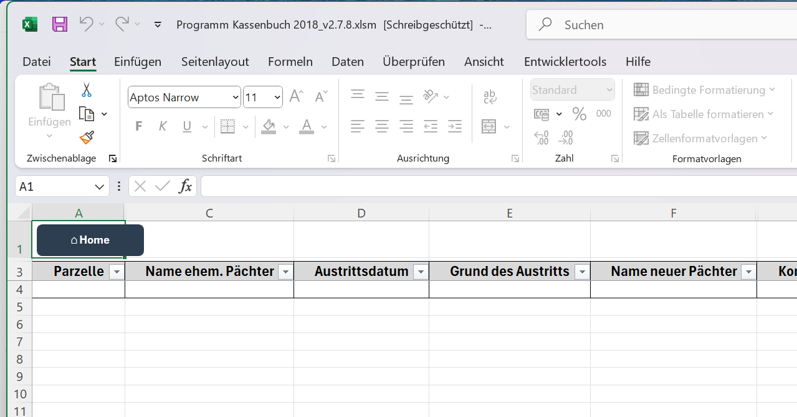

Die **Mitgliederhistorie** hält fest, wer eine Parzelle wann abgegeben hat und wer sie übernommen hat.

| Spalte | Feld |
| --- | --- |
| A | Parzelle |
| B | Mitglieds-ID |
| C | Name des bisherigen Pächters |
| D | Austrittsdatum |
| E | Grund |
| F | Name des neuen Pächters |
| G | ID des neuen Pächters |
| H | Kommentar |
| I | Endabrechnung |
| J | Systemzeit |

Die Einträge entstehen beim Austritt eines Mitglieds. Spalte I dient als dauerhafter Nachweis darüber, ob die Endabrechnung erledigt ist, auch dann noch, wenn das Mitglied längst nicht mehr in der Zahlungsübersicht erscheint.

---

# 15 Sicherung und Wartung

## 15.1 Sicherungen

Sichern Sie die Arbeitsmappe regelmäßig, mindestens nach jedem Monatsimport und in jedem Fall vor dem Jahreswechsel. Eine Kopie auf einem zweiten Datenträger oder in einem Cloud-Ordner genügt.

## 15.2 Makros müssen erlaubt sein

Ohne Makros funktioniert nichts: keine Kachel, kein Import, keine Auswertung. Wenn Excel beim Öffnen einen gelben Sicherheitsbalken zeigt, klicken Sie auf "Inhalt aktivieren".

Erscheint der Balken nicht und die Kacheln reagieren trotzdem nicht, liegt die Datei vermutlich in einem Ordner, den Excel als unsicher einstuft. Legen Sie sie dann in einen als vertrauenswürdig eingestuften Ordner.

## 15.3 Programmstand und Quellcode

Der gesamte Programmcode liegt zusätzlich als Textdateien im Projektordner unter `vba`. Das dient der Nachvollziehbarkeit von Änderungen und der Sicherung. Für die tägliche Arbeit brauchen Sie diesen Ordner nicht.

Wird der Code geändert, muss er in die Arbeitsmappe eingespielt und dort einmal übersetzt werden. Diesen Vorgang beschreiben die Arbeitsregeln des Projekts; er gehört nicht zur normalen Bedienung.

---

# 16 Die Reihenfolge der Einrichtung

Wenn Sie ganz neu anfangen, gehen Sie in dieser Reihenfolge vor. Jeder Schritt baut auf dem vorigen auf.

1. **Einstellungen**: Abrechnungsjahr, Vereinsdaten, Beträge und Kontostände eintragen.
2. **Einstellungen**, Tabelle Zahlungstermine: für jede Kategorie Soll-Betrag, Fälligkeitstag, Vorlauf- und Nachlaufzeit festlegen.
3. **Mitgliederliste**: alle Mitglieder mit Parzelle, Funktion und Pachtbeginn erfassen.
4. **Daten**, Kategorietabelle: Kategorien mit Schlüsselwörtern, Zielspalte und Fälligkeit anlegen.
5. **Bankkonto**: den ersten Kontoauszug importieren.
6. **Daten**, Zuordnungstabelle: die vom Import angelegten Bankverbindungen um Zuordnung, Parzelle und Rolle ergänzen.
7. **Bankkonto**: die gelben und roten Kategorien durchgehen.
8. **Zahlungsübersicht**: das Ergebnis prüfen.

Ab dem zweiten Monat beschränkt sich die Arbeit auf die Schritte 5, 7 und 8. Je besser die Kategorietabelle gepflegt ist, desto weniger bleibt in Schritt 7 zu tun.

---

# 17 Wenn etwas nicht stimmt

## Eine Zahlung taucht bei keinem Mitglied auf

Prüfen Sie zuerst die Zuordnungstabelle auf dem Blatt **Daten**. Ist die IBAN dort eingetragen, aber die Spalten U, V und W sind leer, kann das Programm die Zahlung niemandem zuordnen. Ergänzen Sie Zuordnung, Parzelle und Rolle.

Zahlt jemand anderes als das Mitglied selbst, nutzen Sie die Schaltfläche "Zahlung zuordnen", siehe Abschnitt 7.7.

## Die Kategorie wird erkannt, aber der Betrag fehlt in den Spalten M bis Z

Der Text in Spalte N der Kategorietabelle stimmt nicht mit der Spaltenüberschrift in Zeile 29 des Blattes **Bankkonto** überein. Vergleichen Sie beide genau.

Der zweite mögliche Grund: Die Kategorie ist noch gelb. Gelbe Kategorien werden erst nach Ihrer Bestätigung verteilt.

## Eine Kategorie wird immer wieder falsch erkannt

Schauen Sie sich den Verwendungszweck an und legen Sie in der Kategorietabelle eine zusätzliche Zeile mit einem treffenderen Schlüsselwort an. Hilft das nicht, erhöhen Sie den Rang in Spalte Priorität, also eine kleinere Zahl.

Wenn eine falsche Kategorie gewinnt, ist ihr Schlüsselwort meist zu kurz oder zu allgemein. Ein längeres Schlüsselwort ist fast immer die bessere Lösung als eine Änderung der Priorität.

## Ein Mitglied ist grün, obwohl es nicht gezahlt hat

Prüfen Sie die Bemerkung in Spalte H. Steht dort ein Hinweis auf eine Vorjahreszahlung oder auf eine frühere Angabe, stammt der Status aus einer gespeicherten Entscheidung. Nehmen Sie sie über "Gespeicherte Entscheidung zurücknehmen" zurück, siehe Abschnitt 8.5.

Möglich ist auch, dass der Partner auf derselben Parzelle für beide gezahlt hat. Das ist dann kein Fehler.

## Der Monat in der Zahlungsübersicht stimmt nicht

Ändern Sie ihn nicht dort, sondern in Spalte I des Blattes **Bankkonto**. Das Bankkonto ist maßgeblich; die Zahlungsübersicht übernimmt den Wert von dort.

## Nach dem Jahreswechsel fehlen scheinbar Zahlungen im Januar

Das ist der Fall aus Abschnitt 7.5. Prüfen Sie, ob die betreffenden Mitglieder über-pünktlich zahlen, und beantworten Sie die Rückfrage des Programms entsprechend.

## Das Programm ist langsam geworden

Ein vollständiger Neuaufbau der Zahlungsübersicht braucht bei vielen Buchungen naturgemäß etwas Zeit. Läuft es dauerhaft zäh, schließen Sie die Arbeitsmappe einmal vollständig und öffnen Sie sie neu. Damit werden alle Zwischenspeicher geleert.

## Eine Zelle lässt sich nicht beschreiben

Das ist in aller Regel Absicht. Sehen Sie in der Spaltentabelle des jeweiligen Kapitels nach, ob das Feld für die Eingabe von Hand vorgesehen ist. Berechnete Felder sind bewusst gesperrt.

---

# 18 Anhang: Kurzübersicht der Eingabefelder

Diese Tabelle fasst zusammen, was Sie wo von Hand eintragen. Alles, was hier nicht steht, entsteht automatisch.

| Blatt | Feld | Wann |
| --- | --- | --- |
| Einstellungen | Abrechnungsjahr, Vereinsdaten, Beträge, Kontostände | einmalig und beim Jahreswechsel |
| Einstellungen | Tabelle Zahlungstermine, Spalten B bis I | einmalig, bei Beitragsänderungen |
| Mitgliederliste | Spalten B bis Q | bei Ein- und Austritten |
| Daten | Kategorietabelle, Spalten J bis P | einmalig, bei neuen Schlüsselwörtern |
| Daten | Zuordnungstabelle, Spalten U, V, W, X | nach jedem Import mit neuen Bankverbindungen |
| Bankkonto | Spalte H Kategorie | bei gelben und roten Zeilen |
| Bankkonto | Spalte I Monat/Periode | bei Bedarf |
| Bankkonto | Spalte L Bemerkung | bei Bedarf |
| Zahlungsübersicht | Spalte E Soll bei veränderlichen Beträgen | bei Bedarf |
| Zahlungsübersicht | Spalten F, G, H | bei Bedarf |
| Vereinskasse | Spalten B bis F | bei jeder Barbuchung |
| Strom, Wasser | Spalten B, C, E | zu Jahresbeginn und Jahresende |
